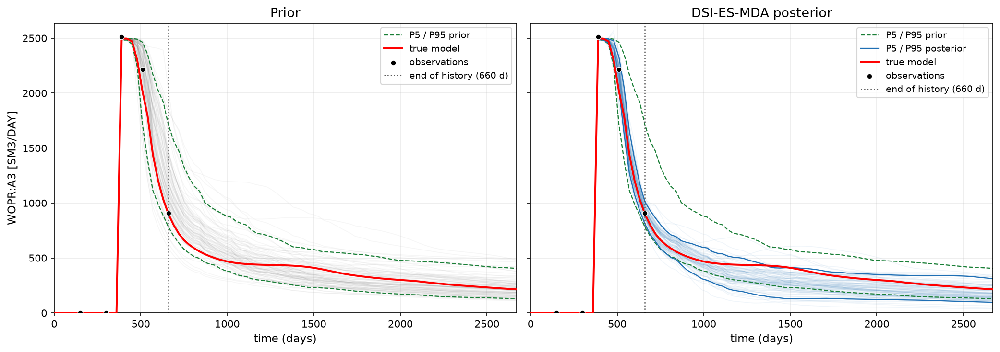

# DSI + ES-MDA

**History matching carried out entirely in data space.** You run the flow
simulator once per prior realisation; from then on the *predicted time series
themselves* are conditioned on the measurements, with no further simulation
runs.

Built around Eclipse / OPM Flow output — `.RSM` summary files or the CSV
exports made from them — with the whole study driven by one YAML file.



Left: the prior ensemble. Right: after four ES-MDA assimilation steps. The
dotted line marks the end of the history period — everything to its right is
forecast, and the posterior band narrows there too. That is the point of DSI.

---

## Contents

- [Why data space](#why-data-space)
- [Install](#install)
- [Quickstart](#quickstart)
- [Input data: what this accepts](#input-data-what-this-accepts)
- [The config file](#the-config-file)
- [What you get back](#what-you-get-back)
- [Plots](#plots)
- [Time grids, and why they need a rule](#time-grids-and-why-they-need-a-rule)
- [Method](#method)
- [Inspecting the assimilation](#inspecting-the-assimilation)
- [Project layout](#project-layout)
- [Scope and limitations](#scope-and-limitations)

---

## Why data space

Conventional history matching perturbs the reservoir model — permeability,
faults, contacts — re-runs the simulator, compares with the measurements and
repeats. Each iteration costs hundreds of simulation runs.

Data Space Inversion (DSI) takes a different route. The simulator runs **once
per prior member**, and the thing that gets updated afterwards is the
*predicted data*: each member's whole time series of oil rate, water rate,
pressure. The ensemble of those time series already carries the correlations
the simulations learned — early water breakthrough goes with lower late oil
rate, and so on — and that is enough to condition the predictions on the
measurements.

So the "model vector" here **is** the data vector, and the observation
operator is plain row selection. Nothing is inverted back to a grid property,
nothing is re-simulated, and a full assimilation takes seconds.

The price is that you get conditioned *predictions*, not a conditioned
reservoir model. If you need updated permeability maps, this is the wrong
tool. If you need P10/P50/P90 forecasts that honour the history, it is a very
cheap way to get them.

## Install

```bash
git clone https://github.com/Aurefpe/dsi-esmda.git
cd dsi-esmda

python -m venv .venv
.\.venv\Scripts\Activate.ps1          # Windows: .\.venv\Scripts\Activate.ps1

pip install -e .
```

Python 3.9 or newer. `-e` installs in *editable* mode, so Python imports the
code straight from `src/` and your edits take effect with no reinstall.

Dependencies (`numpy`, `pandas`, `matplotlib`, `PyYAML`) are declared in
`pyproject.toml` and installed for you. Reading `.xlsx` observations also
needs `openpyxl`.

## Quickstart

The whole study is four calls, and each one takes the same config file:

```python
from dsi_esmda import PriorEnsemble, ObservationSet, run_dsi_esmda
from dsi_esmda.plots import plot_all

config = "configs/csv_example.yaml"

prior        = PriorEnsemble.from_config_file(config)    # 1. the prior
observations = ObservationSet.from_config_file(config)   # 2. the data
results      = run_dsi_esmda(prior, observations, config)  # 3. assimilate
plot_all(results, config)                                # 4. look at it
```

Or the same thing from a terminal:

```bash
python -m dsi_esmda.esmda configs/csv_example.yaml
```

There is deliberately **no `run_study` wrapper**. Those four lines *are* the
workflow: each step's output is the next step's input, and any of them can be
stopped at and inspected. A wrapper would be a second way to do the same
thing, and the two would drift apart.

Example output:

```
PriorEnsemble(95 members: summary_1 ... summary_95, 0 read so far)
ObservationSet from data/True_model/summary_0.csv
  columns      : 5  [from config]
  times        : 5  [from config]
  n_data       : 25
  time match   : nearest, tolerance 15 d, largest shift 6 d
state vector : 595 rows (5 columns x 119 times)
members      : 95
observations : 25 rows
schedule     : Na = 4, alpha = [9.3333, 7.0, 4.0, 2.0]
  step 1/4  alpha = 9.333
  step 2/4  alpha = 7
  step 3/4  alpha = 4
  step 4/4  alpha = 2
saved        : 6 files in results
```

## Input data: what this accepts

### The prior ensemble

One file per realisation, in a folder. Set `prior.type` to say which format:

| `prior.type` | What it reads | Key settings |
| --- | --- | --- |
| `csv` | One CSV per member — the usual export from a post-processor | `folder`, `pattern` (default `*.csv`), `separator` (default `auto`), `time_column`, `recursive` |
| `rsm` | Eclipse / OPM `.RSM` summary files, parsed directly | `folder`, `pattern` (default `*.RSM`), `recursive` |
| `pickle` | One `.pkl` holding a dict of DataFrames, `{"Model1": df, ...}` | `path` |

```yaml
prior:
  type: csv
  folder: ../data/prior_csv
  pattern: "summary_*.csv"
```

Four things worth knowing:

**Members are sorted by the number in the file name**, not alphabetically. So
`summary_2` comes before `summary_10`. A folder listing sorted as plain text
scrambles an ensemble silently, and this is one of the quietest ways to get
wrong answers in an ensemble method.

**Reading is lazy.** Creating a `PriorEnsemble` touches no files. `prior[3]`
reads one; `prior.tables` reads them all. Each file is read once and kept.

**Members need not share report times.** They almost never do — see
[Time grids](#time-grids-and-why-they-need-a-rule).

**The time column** may be called `TIME`, `DAYS`, `DATE` or `YEARS`. Dates
become elapsed days from the first row; years are multiplied by 365.25.

Expected layout of one member — first column time, one column per quantity:

```
TIME,WOPR:A1,WWPR:A1,WBHP:A1,FOPR
0,3980.4,0.0,321.5,8120.9
30,3902.7,0.0,318.2,7964.1
```

Column names follow the Eclipse convention: a field keyword on its own
(`FOPR`, `FWPT`, `FPR`) or `KEYWORD:WELL` for a well (`WOPR:A1`,
`WBHP:NA1A`). `WOPR:A1`, `WOPR_A1` and `WOPRA1` are all recognised as the
same column, because different post-processors spell them differently.

### The observations

Two ways in, and the config chooses with `observations.mode`:

**`mode: truth`** — you have a truth case and want synthetic observations
from it. The truth values at your chosen times are taken, a sigma is computed
for each, and Gaussian noise is added:

```
observed = truth + N(0, sigma)
```

This is what you use to *validate* the method: the answer is known, so the
posterior can be graded rather than admired. Accepted `source.type`:
`csv`, `txt`, `tsv`, `xlsx`, `xls`, `rsm`, `pickle`.

**`mode: file`** (or `measured`) — you have real measured history and it is
used exactly as it is, with no noise added. Accepted `source.type`:
`csv`, `txt`, `tsv`, `xlsx`, `xls`.

```yaml
observations:
  mode: truth
  source:
    type: csv
    path: ../data/True_model/summary_0.csv
```

Same wide layout as a prior member: first column time, one column per
observed quantity. A `.pkl` source may hold a single DataFrame, or a dict of
them with `source.key` naming which one.

### Measurement error — the one thing that cannot be read from your data

```yaml
  error:
    percent: 8.0        # sigma = 8 % of the value ...
    absolute: 1.0       # ... plus 1.0 in the column's own unit
```

`sigma = percent/100 * |value| + absolute`, and `Cd = diag(sigma**2)`.

Give `percent`, `absolute`, or both. **Keep a small `absolute` if any
observed value can be exactly zero** — a water rate before breakthrough, a
cumulative at time zero. A purely relative error gives `sigma = 0` there,
`Cd` becomes singular, and the solve fails. The code refuses that up front
with a message naming the column and the time, rather than failing later in
the linear algebra.

## The config file

One YAML file, five sections. Every path inside it is read **relative to the
config file itself**, so the same config works from any working directory.

```yaml
# ---------------------------------------------------------------- 1. PRIOR
prior:
  type: csv                     # csv | rsm | pickle
  folder: ../data/prior_csv
  pattern: "summary_*.csv"

  times:                        # the grid to extract from every member
    start: 0
    stop: null                  # null = to the end of the shortest member
    step: 30                    # days
  match: nearest                # nearest | exact | interpolate
  tolerance: 15                 # days; how far 'nearest' may reach

  columns: null                 # null = predict what is observed.
                                # List more to forecast quantities you do
                                # NOT observe - that is the point of DSI.

# --------------------------------------------------------- 2. OBSERVATIONS
observations:
  mode: truth                   # truth | file
  source:
    type: csv
    path: ../data/True_model/summary_0.csv

  error:
    percent: 8.0
    absolute: 1.0
  seed: 42                      # same seed -> same synthetic observations

  columns:                      # IN THE ORDER THEY APPEAR IN d_obs
    - WOPR:A1
    - WOPR:A2
    - WOPR:A3
  times: [150, 270, 390, 510, 660]

  match: nearest
  tolerance: 15

# ---------------------------------------------------------------- 3. ESMDA
esmda:
  n_assimilations: 4            # Na: the correction is split into 4 steps
  alpha: [9.3333, 7.0, 4.0, 2.0]
  seed: 1234                    # for the observation perturbations
  ridge: 1.0e-10                # numerical safety on the solve
  clip_negative: true           # rates cannot be negative
  store_states: true            # keep the ensemble after every step
  store_matrices: true          # also keep Cdd, Cmd, the gain and d_uc

# --------------------------------------------------------------- 4. OUTPUT
output:
  folder: ../results
  prefix: dsi

# ----------------------------------------------------------------- 5. PLOT
plot:
  percentiles: [5, 95]
  end_of_history: null          # null = the last observation time
  show_end_of_history: true
  spaghetti: true               # draw every member as a faint line
  ylim: null
  xlim: null
  figsize: [14, 5]
  font_size: 11
  dpi: 150
  folder: ../results/plots
  columns: null                 # null = one figure per quantity
```

### Every setting, by section

**`prior`** — `type`, `folder` (or `path` for a pickle), `pattern`,
`separator`, `time_column`, `recursive`, `times`, `match`, `tolerance`,
`columns`.

**`observations`** — `mode`, `source.{type, path, key}`,
`error.{percent, absolute}`, `seed`, `columns`, `times`, `match`,
`tolerance`, `unit_factors`, `time_column`.

**`esmda`** — `n_assimilations`, `alpha`, `seed`, `ridge`, `clip_negative`,
`store_states`, `store_matrices`. Unknown keys are **rejected**, so a typo
stops the run instead of silently leaving a default in place.

**`output`** — `folder`, `prefix`.

**`plot`** — `percentiles`, `end_of_history`, `show_end_of_history`,
`spaghetti`, `ylim`, `xlim`, `figsize`, `font_size`, `dpi`, `folder`,
`columns`.

### `columns` and `times` can live in text files

Long lists clutter a config. Point at a file instead — one entry per line,
`#` starts a comment, blank lines ignored:

```yaml
  columns: obs_columns.txt
  times: obs_times.txt
```

To generate a safe list of times — those reported by *every* prior member
and by the truth case, which are the only times an observation can honestly
sit on:

```python
from dsi_esmda import PriorEnsemble

prior = PriorEnsemble.from_config_file("configs/csv_example.yaml")
prior.write_common_times("configs/obs_times.txt",
                         also="data/True_model/summary_0.csv",
                         start=150, stop=660)
```

### Finding out what you can put in it

```python
from dsi_esmda import describe_source

describe_source("data/True_model/summary_0.csv")
```

```
  time column : 'TIME'
  times       : 119  from 0 to 3540
  columns     : 685

  keyword   wells
  ------------------------------------------------------------
  FOPR      (field)
  WBHP      A1, A2, A3, A4, A5, ...
  WOPR      A1, A2, A3, A4, A5, ...

  first 20 times (use these in 'times'):
  0, 30, 60, 90, 120, 150, ...
```

## What you get back

`run_dsi_esmda` returns a `DSIResult`. The ensembles are
`(n_state, n_members)` arrays, with the state vector stacked
**variable-major**: all times of variable 1, then all times of variable 2, so
`row = var_index * n_times + time_index`.

| Attribute | What it is |
| --- | --- |
| `.prior`, `.posterior` | the data ensembles, `(n_state, n_members)` |
| `.columns`, `.times`, `.members` | what the rows and columns mean |
| `.labels` | DataFrame: name, keyword, well, time for **every** row |
| `.misfit` | DataFrame, one row per assimilation step |
| `.bands` | DataFrame: P10/P50/P90 and mean, prior and posterior, per quantity and time, with the observations merged in |
| `.d_obs`, `.Cd`, `.sigma` | the observation vector and its covariance |
| `.obs_rows` | which rows of the state were measured |
| `.n_state`, `.n_members`, `.n_assimilations` | shapes |
| `.n_clipped` | how many posterior values were raised to zero |
| `.saved` | the files written |

Methods:

```python
results.member_series("WOPR:A1")            # rows = times, cols = members
results.truth_series("WOPR:A1")             # the true curve, when there is one
results.at_observations(results.posterior)  # the observed rows only
results.state_after(2)                      # the ensemble after two steps
results.iteration(1).Cdd                    # one step's matrices
results.summary()                           # a short text report
results.save("results", prefix="dsi")       # write everything
```

### Files written

Saved automatically when the config has an `output` section — pass
`save=False` to keep everything in memory.

| File | Contents |
| --- | --- |
| `dsi_ensembles.npz` | prior, posterior, times, columns, members, `d_obs`, sigma, alpha, **every intermediate state** (`state_after_00` … ), and `Cdd`/`Cmd`/`gain`/`system`/`d_sim`/`d_uc` per step when `store_matrices` is on |
| `dsi_bands.csv` | the P10/P50/P90 table — everything needed to redraw the figures elsewhere |
| `dsi_misfit.csv` | misfit and spread before and after each step |
| `dsi_labels.csv` | what every row of the state vector is |
| `dsi_d_obs.csv` | the observations and their sigma, per time and quantity |
| `dsi_d_obs_vector.csv` | one row per entry of `d_obs`, fully labelled |

That last file answers "what is row 23 of my data vector?" without counting
indices by hand — which is the class of mistake that produces plausible,
wrong answers.

## Plots

```python
from dsi_esmda.plots import (plot_match, plot_all, plot_misfit,
                             plot_observation_fit)

plot_match(results, "WOPR:A1", config)   # one quantity, two panels
plot_all(results, config)                # one PNG per quantity
plot_misfit(results)                     # convergence
plot_observation_fit(results)            # simulated against observed
```

| Function | What it shows | Read it for |
| --- | --- | --- |
| `plot_match` | Prior on the left, posterior on the right. Every member as a faint line, P5/P95 of the prior on **both** panels for comparison, P5/P95 of the posterior on the right only, the truth in red, the observations as filled black circles, and a dotted line at the end of history. | Did the ensemble narrow, and did it narrow **onto** the truth — including to the right of the dotted line, where nothing was observed? |
| `plot_all` | One `plot_match` figure per quantity, saved to the plot folder. Names are made Windows-safe (`WOPR:A1` → `WOPR_A1.png`). | A whole field at a glance. |
| `plot_misfit` | Normalised misfit after each step, log scale, with the α of each step annotated and a target line at 1. | Convergence. Near 1 is matched; well above means the data was not fitted; far below means over-fitting and a collapsed spread. |
| `plot_observation_fit` | Observed on x, posterior mean on y, one point per entry of `d_obs`, with one-sigma error bars and a 45° line. | Systematic bias. A cloud sitting above or below the diagonal is obvious here and easy to miss in a time-series plot. |

Styling comes from the config's `plot` section, so the calls take no styling
arguments. Anything you do pass wins over the config.

The prior band is drawn on both panels deliberately: it makes the narrowing
visible in one glance. The posterior band is drawn **only** on the posterior
panel — putting it on the prior panel would show a match the prior never
achieved.

`plot_esmda_results(...)` is also kept, with the fourteen-argument signature
used by pre-package scripts, along with `legacy_arguments(result, name)` to
build those arguments from a modern result.

## Time grids, and why they need a rule

Eclipse and OPM Flow **do not report on the dates you ask for.** They report
at the timesteps they happened to converge on, so a run set up for "every 30
days" comes back with times like

```
0, 1, 1.702, 2.665, ..., 30, 38.33, 45.41, 52.71, 60, 68.55, ...
```

and two members of the same ensemble do not agree with each other, because
the simulator inserted its extra steps in different places. On one real
30-member ensemble, exactly **one** report time was shared by all members.

So you state the grid you want, and how it should be lined up:

| `match` | Behaviour | Cost |
| --- | --- | --- |
| `exact` | The time must really be there. | Fails on most simulator output. Right when your deck writes fixed report dates. |
| `nearest` | Take the closest reported time, within `tolerance` days. | The value is real; it belongs to a slightly different day. **The practical default.** |
| `interpolate` | Straight line between the two neighbouring reported times. | You get the exact date, but the value is computed, not reported. |

Whichever you choose, **the largest shift applied is always reported** — so
`largest shift 6 d` in the output tells you how far the data had to be
stretched, rather than leaving you to assume it wasn't.

`stop: null` means "to the end of the shortest member", so every member
covers the whole grid; the value chosen is printed.

## Method

ES-MDA applies the correction in `Na` steps rather than one, each with the
measurement error inflated by `alpha[k]`:

```
for each assimilation step k:
    d_sim = the observed rows of each member's state vector
    d_uc  = d_obs + sqrt(alpha[k]) * sigma * z,   z ~ N(0, 1)   per member
    M     = M + Cmd (Cdd + alpha[k] Cd)^-1 (d_uc - d_sim)
```

`Cdd` is the ensemble covariance of the simulated data and `Cmd` the
state-to-data cross-covariance — both estimated from the spread between
members, not assumed. `Cmd` is what carries information from the observed
times to the unobserved ones, and is the reason DSI can forecast at all.

For the steps to add up to **one** full assimilation, the inflation factors
must satisfy

```
sum(1 / alpha[k]) = 1
```

Below 1 the data is under-used and the posterior stays too close to the
prior; above 1 the data is counted more than once and the spread collapses.
Neither failure announces itself in the output, so it is checked and a
warning printed. `alpha: null` uses `[Na, Na, ...]`, which is always valid.

Three implementation choices worth stating:

**The observation operator is row selection.** A member's simulated data *is*
the observed rows of its state vector. Nothing is interpolated or projected
inside the update, which removes a whole class of possible mistakes.

**`Cmd` is never formed.** The update is applied as
`state_anomaly @ (data_anomaly.T @ solve(system, residual)) / (Ne - 1)`,
which is algebraically identical and avoids the largest array involved.
`store_matrices: true` builds `Cmd` and the gain separately, for inspection.

**The observation noise is not `abs()`-ed.** Some implementations take the
absolute value of the perturbation, which makes every draw positive and
biases the posterior upwards. The noise has to be symmetric about zero.

## Inspecting the assimilation

With `store_states` and `store_matrices` on, every intermediate quantity is
kept — so the update can be checked rather than trusted:

```python
results.state_after(0)      # the prior
results.state_after(2)      # the ensemble after two steps
results.iteration(1).Cdd    # ensemble covariance of the simulated data
results.iteration(1).Cmd    # state-to-data cross-covariance
results.iteration(1).gain   # the Kalman gain
results.iteration(1).d_uc   # the perturbed observations actually used
```

Which makes this identity testable, and it holds to numerical precision:

```
state_after(k) == state_after(k-1) + Cmd @ solve(Cdd + alpha*Cd, d_uc - d_sim)
```

Since the solver never forms `Cmd`, that is a real check of the fast
implementation against the textbook Kalman form — not a tautology.

### A note on clipping

Rates, cumulatives and pressures cannot be negative, but neither Gaussian
measurement noise nor a linear update knows that, so negative values are
raised to zero (`clip_negative: true`).

That is a physical fix at a statistical price: it removes the lower tail, so
the affected values are no longer unbiased and their real spread is smaller
than the sigma recorded in `Cd`. The count is printed rather than hidden —
`obs.n_clipped` and `results.n_clipped` — so you can judge whether it matters
for your case. If it bites on a large fraction of your data, the honest fix
is to stop observing quantities that sit at zero in your history window.

## Project layout

```
dsi-esmda/
├── configs/csv_example.yaml     a complete, commented study config
├── data/
│   ├── prior_csv/               the prior ensemble, one CSV per member
│   └── True_model/              the truth case (CSV and .RSM)
├── docs/example_match.png       the figure above
└── src/dsi_esmda/
    ├── config.py                reading the config, resolving its paths
    ├── rsm_reader.py            one .RSM file -> pandas DataFrame / CSV
    ├── priors.py                the ensemble -> the prior data matrix
    ├── observations.py          d_obs, sigma and Cd
    ├── esmda.py                 the DSI + ES-MDA assimilation
    └── plots.py                 prior vs posterior figures
```

The `src/` layout is deliberate: the package cannot be imported by accident
from the project root, so tests and scripts exercise the *installed* package
exactly as a user would.

## Scope and limitations

**No Gaussian transform.** Some DSI papers first push each data variable
through a histogram (normal-score) transform so the ensemble looks Gaussian,
invert, then transform back. That is not done here — ES-MDA is applied to the
data values as they are. This is a legitimate and much simpler formulation,
but it is not identical to those papers, so results from this code should not
be described as "DSI with Gaussian transform".

**Conditioned predictions, not a conditioned model.** Nothing here updates a
reservoir property. The posterior is a set of data vectors.

**The update lives in the span of the ensemble.** With `Ne` members the
correction can only move within at most `Ne - 1` dimensions, however long the
state vector is. A small ensemble understates the posterior spread — that is
a property of ensemble methods, not a bug, but it is worth remembering when
reading a narrow band.

**Diagonal `Cd`.** Measurement errors are assumed independent: an error on
well A tells you nothing about the error on well B. Correlated measurement
error is not supported.

## Data and licence

`data/prior_csv/` holds the prior ensemble and `data/True_model/` the truth
case. See `data/README.md` for their provenance and terms.

The code is MIT-licensed (see `LICENSE`); that licence covers the code, not
any benchmark data.

## Author

**Auref Rostamian**  PhD., University of Stavanger
